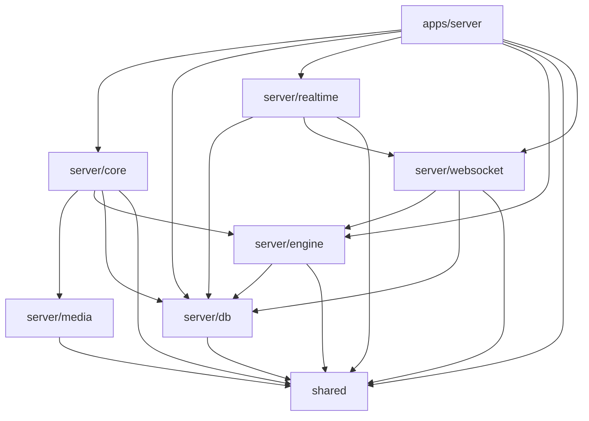

# Server Dependency DAG

Last generated: 2026-02-13

## Package DAG (workspace dependencies)

| Layer | Package | Workspace deps |
| --- | --- | --- |
| `apps/server` | `@abe-stack/server` | server/core, server/db, server/realtime, server/engine, shared, server/websocket |
| `server/core` | `@abe-stack/core` | server/media, server/engine, server/db, shared |
| `server/engine` | `@abe-stack/server-engine` | server/db, shared |
| `server/realtime` | `@abe-stack/realtime` | server/db, server/websocket, shared |
| `server/websocket` | `@abe-stack/websocket` | server/engine, server/db, shared |
| `server/media` | `@abe-stack/media` | shared |
| `server/db` | `@abe-stack/db` | shared |
| `shared` | `@abe-stack/shared` | — |

## Import Edge Hotspots (source-level)

> Counts are import occurrences across `main/apps/server/src` + `main/server/*/src`.
> Self-imports and `-> shared` edges are excluded from this hotspot list.

| From | To | Import count |
| --- | --- | ---: |
| `server/core` | `server/db` | 182 |
| `apps/server` | `server/engine` | 65 |
| `server/core` | `server/engine` | 54 |
| `apps/server` | `server/core` | 49 |
| `server/engine` | `server/db` | 14 |
| `apps/server` | `server/db` | 8 |
| `server/realtime` | `server/db` | 4 |
| `apps/server` | `server/realtime` | 2 |
| `apps/server` | `server/websocket` | 2 |
| `server/websocket` | `server/db` | 2 |
| `server/core` | `server/media` | 1 |
| `server/realtime` | `server/websocket` | 1 |
| `server/websocket` | `server/engine` | 1 |

## Refactor Guidance

- Keep `server/core` as reusable domain/business logic package.
- Keep `apps/server` as composition/integration shell (bootstrap, wiring, plugins, runtime registration).
- Move code from `server/core` to `apps/server` only when it is app-runtime-specific.
- App-runtime-specific examples: Fastify plugin lifecycle, process/env bootstrap, app-only adapters.
- Do not collapse `server/core` into `apps/server`; this would couple domain logic to app runtime and reduce testability/reuse.
