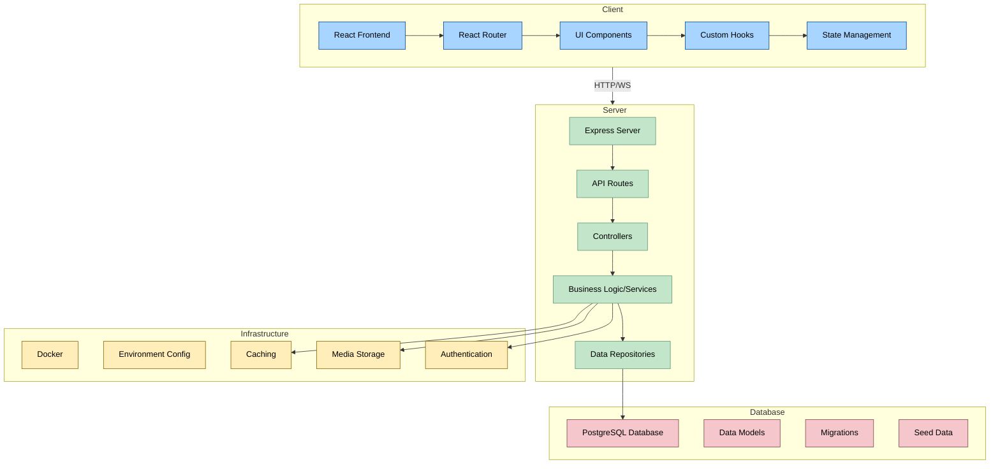

# ABE Stack Architecture

Below is an architecture diagram that illustrates the key components and data flow in the ABE Stack application.

## Component Descriptions

### Client
- **React Frontend**: Main client application
- **React Router**: Handles frontend routing and navigation
- **UI Components**: Reusable interface elements
- **Custom Hooks**: Shared logic for components
- **State Management**: Manages application state

### Server
- **Express Server**: Web server handling HTTP requests
- **API Routes**: Endpoint definitions and request routing
- **Controllers**: Request handling and response formatting
- **Business Logic/Services**: Core application functionality
- **Data Repositories**: Data access abstraction layer

### Database
- **PostgreSQL**: Relational database for data storage
- **Data Models**: Schema definitions for entities
- **Migrations**: Database schema version control
- **Seed Data**: Test/demo data population

### Infrastructure
- **Docker**: Containerization for consistent environment
- **Environment Config**: Configuration for different environments
- **Caching**: Performance optimization layer
- **Media Storage**: For handling uploaded files and media
- **Authentication**: User identity and access control

## Data Flow

1. Client components make requests to the server via API calls
2. Server routes direct the requests to appropriate controllers
3. Controllers coordinate with services to execute business logic
4. Services use repositories to access/modify data in the database
5. Results flow back up the stack to the client

This architecture follows a clean, multi-layered approach that separates concerns and promotes maintainability and scalability. 